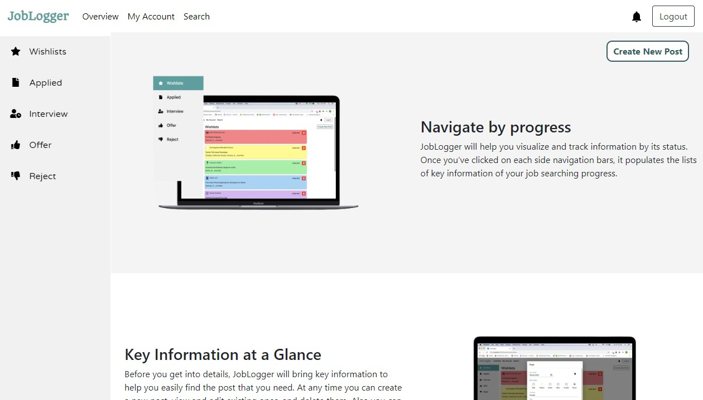

# JobLogger

## Table of Contents
- [Description](#description)
- [UserStory](#userstory) 
- [Demo](#demo) 
- [Technologies](#technologies) 
- [License](#license) 
- [Question](#question)

## Description
Hunting for a new job is hard.  There are so many things to keep track of, contact information, details of how your interviews have gone, salaries, the list is endless.  

JobLogger helps you keep track of all that in a central location, as well as offering a portal to search for jobs and easily save them.  You can track your employment opportunities, from a wishlist for things you want to apply to but haven't yet, all the way through to tracking the status of interviews and offers, to saving positions you've heard back on for future reference.  JobLogger is here to make the search easier for you so you can spend your time where it counts.

## UserStory
```
As a person who is looking for work and struggling with keeping track of opportunities,
I want to store and track all of my information surrounding my job search,
So that I can better organize myself and spend my time searching for jobs and not managing spreadsheets.
```

## Demo
### Heroku URL
[Click Here to check out JobLogger](https://joblogger-loc.herokuapp.com/)

### Screenshots


This is the main page of our application. You can sign up locally or use your LinkedIn account to login.


Login/Registration Page.


Overview Page: On this page, you can keep track on your job application status by changing and updating its status. You can manually add the job listings that you are interested in or you can also save them from the search engine result that is provided next to this page.




Job Search Engine: The API was provided by [Github Public API](https://jobs.github.com/api). Users can search the job listings by typing in the keywords such as web developer, software engineer, node and so on. If there is a listing that you want to add it to the wishlist, you can simply add it by clicking the `Save to Wishlist` button.


Settings Page: On this page you can see and update your personal information, and update your password.


## Technologies
- MongoDB ([Documentation](https://docs.mongodb.com/)) and Mongoose ([Documentation](https://mongoosejs.com/docs/api.html))
- Express ([Documentation](https://expressjs.com/en/api.html)), Bcrypt ([Documentation](https://www.npmjs.com/package/bcrypt)), Passport ([Documentation](https://www.npmjs.com/package/passport))
- ReactJS ([Documentation](https://reactjs.org/docs/getting-started.html)), Material UI ([Documentation](https://material-ui.com/)), Bootstrap ([Documentation](https://getbootstrap.com/))
- Node ([Documentation](https://nodejs.org/en/docs/))

### External APIs
- [Github Public API](https://jobs.github.com/api) was used to return simple job postings information such as location, title, company, description and so on, based on a searched position.

## License

- **[MIT License](https://opensource.org/licenses/MIT)** 
- 2020 League of Coders 

## Question
| Ask Me Now! | Ask Me Now! | Ask Me Now! |
| :---: | :---: | :---: |
|  |  |  |
| <a style="text-decoration: none; color: red" href="https://github.com/nuleeannajeon" target="_blank">Anna Jeon</a> | <a style="color: orange" href="https://github.com/tndus604" target="_blank">Haley Jeon</a> | <a style="color: green" href="https://github.com/titanian229" target="_blank">James Lee</a> |
| <a style="text-decoration: none; color: red" href="https://secure-refuge-78863.herokuapp.com/" target="_blank">Website</a> | <a style="color: orange" href="https://young-ravine-81604.herokuapp.com/" target="_blank">Website</a> | <a style="color: green" href="jamesdeveloping.ca" target="_blank">Website</a> |